# Database Schema Diagram

This document contains the Entity Relationship Diagram (ERD) for the current data model, based on the `schema.sql`, `server/schemas/invoices.sql` files, and applied migrations in `server/migrations/`.

## Entity Relationship Diagram

```mermaid
erDiagram
    %% ==========================================
    %% AUTHENTICATION & USERS
    %% ==========================================
    users ||--o| roles : "has role"
    users ||--o| profiles : "has profile"
    users ||--o{ password_reset_tokens : "has tokens"
    users ||--o{ audit_logs : "performs actions"

    roles ||--o{ role_rol_profiles : "link"
    rol_profiles ||--o{ role_rol_profiles : "link"
    rol_profiles ||--o{ rol_profile_auth_objects : "link"
    authorization_objects ||--o{ rol_profile_auth_objects : "link"

    users {
        int id PK
        string email
        boolean is_active
    }
    roles {
        int id PK
        string name
        string description
    }
    profiles {
        int id PK
        int user_id FK
        string first_name
        string last_name
        string nif
    }
    rol_profiles {
        int id PK
        string name
    }
    authorization_objects {
        int id PK
        string object_type
        string code
    }

    %% ==========================================
    %% INVOICING CORE
    %% ==========================================
    factura }o--|| emisor : "issued by"
    factura }o--|| receptor : "received by"
    factura ||--o{ linea_factura : "contains"
    factura ||--o{ log_factura : "audit log"
    factura ||--o{ adjunto : "attachments"
    factura }o--|| origenes : "source channel"
    
    linea_factura }o--|| impuesto : "applies tax"

    factura {
        uuid id_factura PK
        string numero
        string serie
        date fecha_emision
        string estado
        string tipo "ISSUE/RECEIPT"
        string codigo_tipo "01/02"
        int id_origen FK
        date fecha_operacion
        numeric total
    }
    emisor {
        uuid id_emisor PK
        string nif
        string nombre
    }
    receptor {
        uuid id_receptor PK
        string nif
        string nombre
    }
    impuesto {
        uuid id_impuesto PK
        string codigo
        numeric porcentaje
    }
    linea_factura {
        uuid id_linea PK
        uuid id_factura FK
        numeric cantidad
        numeric precio_unitario
        numeric total_linea
    }
    origenes {
        int id_origen PK
        string descripcion
    }
    audit_logs {
        int id PK
        int user_id FK
        string action
        string entity_type
    }

    %% ==========================================
    %% PRODUCT CATALOG
    %% ==========================================
    producto ||--o{ producto_traduccion : "translations"
    producto ||--o{ producto_precio : "prices"
    producto }o--|| impuesto : "default tax"

    producto {
        uuid id_producto PK
        string sku
        string tipo
        numeric precio_base
    }
    producto_traduccion {
        uuid id_traduccion PK
        uuid id_producto FK
        string codigo_idioma
        string nombre
    }
    producto_precio {
        uuid id_precio PK
        uuid id_producto FK
        string codigo_pais
        numeric precio
    }

    %% ==========================================
    %% WORKFLOW ENGINE
    %% ==========================================
    workflows ||--o{ workflow_nodes : "nodes"
    workflows ||--o{ workflow_edges : "edges"
    workflow_nodes ||--o{ workflow_edges : "source"
    workflow_nodes ||--o{ workflow_edges : "target"

    workflows {
        uuid id PK
        string name
        boolean is_active
    }
    workflow_nodes {
        uuid id PK
        uuid workflow_id FK
        string type
        string label
    }
```

